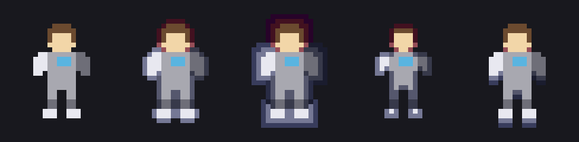

# ase-outline

An Aseprite outline that takes its colour from the art it touches, instead of
from a swatch. A white sleeve and dark armour on the same silhouette come out
with contours that belong to each of them.

Adds **Edit → FX → Colored Outline…**



*Left to right: no outline; circle at thickness 1; square at thickness 2; an
inward rim; bottom row only at thickness 2. The grey armour picks up a
slate-blue contour, the near-white cuffs a lavender one, the brown hair a
wine-red one — all from one set of sliders. Regenerate with `make test`.*

## How the colour is picked

Every pixel the mask points at looks at its neighbours and adopts the colour of
whichever one it mostly borders — orthogonal neighbours vote twice, so a
contour running along an edge keeps that edge's colour instead of averaging
into mud at every corner. Ties break toward the lower packed value, so the same
art always yields the same pixels.

That colour is then shaded the way an artist picks a shadow by hand:

| Lever | What it does |
| --- | --- |
| **Shadow tint** | The hue everything drifts toward. Default is a cool violet-blue. |
| **Hue shift** | How far, in degrees, a colour may travel toward the tint. Capped rather than proportional: a plain fraction sends brown hair through magenta, because the short arc from warm to cool runs through pink. Neutrals have no hue to defend and adopt the tint outright — that is what turns grey armour blue-grey. |
| **Darken** | Value drop, applied per ring, so a thick outline keeps falling off. |
| **Saturate** | A little colour added, which is what stops the result reading as soot. |

## Shape

The dialog mirrors the built-in Outline.

**Sides** is a 3×3 mask, the same model Aseprite stores in `aseprite.ini` as a
9-bit number (`Matrix = 495` is `0b111101111`, every neighbour but the centre).
The four preset buttons — Circle, Square, Horiz., Vert. — are that same
encoding: `170`, `495`, `40`, `130`.

The grid is a drawn canvas with clickable cells, not nine checkboxes: a Lua
dialog lays widgets out in rows and will not hold nine of them in a square, and
a grid is what the built-in dialog shows anyway. Lit cells take the theme's
`selected` colour, unlit ones `editor_face`, and the cell under the pointer is
outlined so it is obvious what a click will toggle. The centre cell stands for
the art itself and does nothing.

A dialog canvas stretches to the width of the dialog and cannot be told not to,
so the grid is centred in whatever width it is handed and the surround is
painted in the theme's `face` colour — it reads as a grid on the dialog rather
than as a wide coloured slab.

A lit cell is **where the contour goes**, not which neighbour gets probed.
Light the bottom row and only the underside is outlined. For the four presets,
all symmetric, the two readings coincide, and each one reproduces exactly what
the built-in command draws for the same name.

The image grows only on the sides the mask reaches, so a horizontal-only
outline does not leave a transparent margin above and below.

**Place** is Outside or Inside. An inward rim shades the art's own edge pixels
from their own colour and never grows the cel.

**Thickness** is 1–4 rings, each one darker than the last.

## Selection, scope, and preview

A selection clips the result the way every Aseprite filter clips: the shape is
read whole, but only pixels inside the selection are written. No selection
means the whole cel.

**Apply to** is Active cel, Selected cels (the timeline range), or All cels.
Layers whose name already ends in `outline` are skipped, so re-running never
outlines an outline.

**Preview** draws on the real canvas. Each update is one transaction rolled
back with `app.undo()` before the next, so dragging sliders leaves the undo
stack where it started; the rollback only fires when the previous pass actually
drew something.

**OK** keeps the result and closes. **Cancel** rolls it back. **Apply** keeps
the ring and makes it the shape the *next* ring grows around, on its own layer
— `art outline`, then `art outline 2`, and so on. Applying twice gives two
rings, each shaded off the one inside it, rather than one layer drawn twice.

The next ring grows around the art *and* every ring already kept, not around
the last ring alone: a ring on its own is hollow, and outlining a hollow shape
fills its middle as well as its outside.

What gets outlined is decided once, when the dialog opens, and never re-read
from the live selection. It has to be: `sprite:newLayer()` moves Aseprite's
active layer onto the layer it just made, so by the second pass the "active
cel" is the outline rather than the art.

## Where the result goes

A layer named `<layer> outline`, in the same group as the source — under it for
an outward outline, over it for an inward one, since an inward rim has to
render in front of the art. The original pixels are never touched, and
re-running reuses that layer instead of stacking a new one per attempt.

Inner contours come for free *only* when the parts are on separate layers: run
it per-layer and an arm gets outlined against the body. On a flattened sprite
there is one silhouette, so there is one outline.

## Colour modes

RGB is the honest case. Indexed art snaps to the existing palette whether or
not the option is on — there is nowhere else to put a colour — so the result is
only as good as the ramp already in the file, and it will happily reuse a
colour the art is using. Grayscale keeps the value drop and throws the hue away.

## Install

```bash
make install     # straight into the extensions folder; restart Aseprite
```

or build a double-clickable bundle:

```bash
make extension   # dist/ase-outline.aseprite-extension
```

## Tests

```bash
make test
```

- `shape_test` — mask semantics, both placements, per-side growth and selection
  clipping, checked against ASCII pictures.
- `theme_test` — every theme colour id the dialog asks for exists, checked
  against Aseprite's own `theme.xml`. An unknown id resolves to a transparent
  colour rather than an error, so nothing at runtime would have complained.
- `targets_test` — that what gets outlined survives `newLayer` stealing the
  active layer. It asserts that stealing still happens, so the day Aseprite
  stops doing it, the test says so instead of quietly passing.
- `layers_test` — the outline layer lands on the right side of the art and
  survives being flipped across it.
- `apply_test` — two Applies leave two rings, on two layers, not overlapping,
  each darker than the one inside it.
- `outline_test`, `modes_test` — the colour rule and the colour modes, plus
  `out/*.png` for eyeballing.

The dialog itself cannot run headless — `Dialog()` returns nil under `-b` — so
nothing here covers the preview, the buttons, or the canvas grid's hit-testing.
That part needs the GUI.

## Status

v0.3.1. Known gaps: no Tiled option, and no directional light — every side of
the silhouette is shaded equally, where art usually wants the contour lighter
where the light hits and darker underneath.
